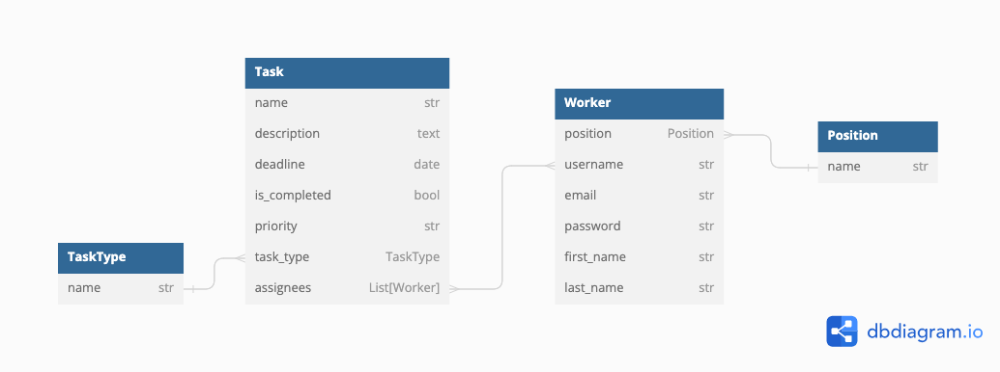

# IT Team Task Manager

## How to install

1) Open Terminal and open folder to clone project in.

2) Clone repository into a desirable folder:

    ```
    git clone https://github.com/mykolamateichuk/it-company-task-manager.git
    ```

3) Open cloned folder in terminal

4) If you don't have **pip** installed  [install it here](https://pip.pypa.io/en/stable/installation/#).

5) Create and activate **Virtual environment**:
   
   **Windows**
   ```
   python -m venv venv
   ```
   
   ```
   venv\Scripts\activate
   ```
   
   **MacOS**
   ```
   python3 -m venv venv
   ```
   
   ```
   source venv/bin/activate
   ```
   
6) Open cloned folder and install needed requirements using:

    ```
    pip install -r requirements.txt
    ```

7) Make migrations and migrate:

   ```
   python manage.py makemigrations
   ```
   ```
   python manage.py migrate
   ```

8) Install database fixture:

   ```
   python manage.py loaddata db_fixture.json
   ```

9) Run server:
   
   ```
   python manage.py runserver
   ```

10) Go to [http://127.0.0.1:8000/](http://127.0.0.1:8000/)


## How does it work

This task manager is built for _a small team of developers who want to manage 
their workflow properly_.

To access the page first you want to [register](http://127.0.0.1:8000/create-account/) yourself.

Then you will be redirected onto the [main page](http://127.0.0.1:8000/), where 
you will see all of your **tasks**.

Tasks that have not been completed yet have a red border, tasks that have been - green.
Tasks have a detailed view that is accessible by clicking on the specific task card.
In this detailed view you can see all information about the task and also **Update** it, 
**Delete** it, or **Mark as Done**.

Any member of the team can create tasks and assign them to other members or themselves.
To create a task click on the green button in the top part of the screen, and 
you will be redirected to the [task creation form](http://127.0.0.1:8000/create-task/).

On the left of the page you will see a sidebar that can redirect you to 
[Team](http://127.0.0.1:8000/worker-list/) page that has information about everyone
on your team. To see their progress in solving tasks you can click on the username 
of a specific user and see how many tasks are still due for them.

Also you can filter the list of your teammates by their **position**.

The second page where sidebar can take you to, is [Deadlines](http://127.0.0.1:8000/deadlines/).
Deadlines is a page that has a compact view on all of your tasks and can help you 
with deciding whick task to do next.

## Database Schema

